# Galpi - 나만의 교통 카드 앱

자주 이용하는 지하철/버스 경로를 카드처럼 저장하고, 카드 상세 화면에서 실시간 도착정보를 빠르게 확인할 수 있는 React Native 기반 교통 앱입니다.

매번 지도 앱에서 출발지와 도착지를 다시 검색하지 않고, 자주 쓰는 이동 경로를 카드로 저장해 한 번에 확인하는 것을 목표로 합니다.

## 주요 기능

- 자주 이용하는 이동 경로 카드 생성
- 카드 이름, 색상, 즐겨찾기 설정
- 홈 화면 카드 목록 및 상세 화면 이동
- Firebase 기반 로그인/회원가입
- Firebase Firestore 기반 사용자별 카드 저장
- 로그인한 사용자별 카드 목록 실시간 동기화
- 지하철 승차역/하차역 검색
- 승차역과 하차역 기반 지하철 방향 자동 계산
- 지하철 실시간 도착정보 조회
- 지하철 시간표 기반 다음 예정 출발 정보 보완
- 버스 노선 검색
- 버스 승차 정류장/하차 정류장 선택
- 버스 실시간 도착정보 조회

## 기술 스택

- React Native
- Expo
- Expo Router
- TypeScript
- Firebase Authentication
- Firebase Firestore
- 서울시 공공데이터 API
- 공공데이터포털 API
- fast-xml-parser
- AsyncStorage
- reanimated-color-picker
- Ionicons

## 핵심 구현

### 카드 기반 경로 관리

사용자는 자주 이용하는 경로를 하나의 카드로 생성할 수 있습니다.  
카드는 이름, 색상, 즐겨찾기 여부를 가질 수 있으며 홈 화면에서 카드 형태로 표시됩니다.

생성된 카드를 선택하면 상세 화면에서 저장된 지하철/버스 경로와 실시간 도착정보를 확인할 수 있습니다.

### Firebase 기반 사용자 데이터 관리

Firebase Authentication을 사용해 이메일/비밀번호 기반 로그인과 회원가입을 구현했습니다.

로그인한 사용자의 카드 데이터는 Firebase Firestore에 저장됩니다.  
사용자별로 카드 데이터가 분리되어 관리되며, Firestore의 실시간 구독을 통해 카드 목록 변경사항이 화면에 반영됩니다.

카드 데이터 저장 흐름:

    로그인
    → Firebase Auth에서 사용자 uid 확인
    → users/{uid}/cards 경로에 카드 저장
    → Firestore onSnapshot으로 카드 목록 실시간 구독
    → 홈 화면에 카드 목록 표시

### 지하철 경로

지하철은 승차역과 하차역을 선택하면 앱 내부에서 이동 방향을 자동으로 계산합니다.

이를 위해 노선별 역 순서 데이터를 사용합니다.

    src/data/subwayLineStations.ts
    src/utils/subwayRouteUtils.ts

저장된 승차역, 하차역, 호선, 방향 정보를 기준으로 실시간 도착정보를 조회하고, 실제 하차역까지 갈 수 있는 열차만 필터링해 보여줍니다.

### 버스 경로

버스는 노선을 먼저 검색한 뒤, 해당 노선의 정류장 목록에서 승차 정류장과 하차 정류장을 선택하는 방식으로 구성되어 있습니다.

카드 상세 화면에서는 저장된 버스 노선 ID와 승차 정류장 ID를 기준으로 실시간 도착정보를 조회합니다.

버스 API 응답은 XML 형식이기 때문에 `fast-xml-parser`를 사용해 앱에서 사용할 수 있는 데이터로 변환합니다.

### 실시간 도착정보

지하철과 버스 모두 카드 상세 화면에서 실시간 도착정보를 조회합니다.

지하철은 같은 역에 여러 호선과 방향의 열차가 함께 올 수 있기 때문에 다음 조건으로 필터링합니다.

    같은 호선인지
    같은 방향인지
    선택한 하차역까지 갈 수 있는 열차인지

버스는 노선 ID와 정류장 ID를 기준으로 도착정보를 조회합니다.

## 프로젝트 구조

    src
    ├─ api
    │  ├─ subwayApi.ts
    │  ├─ busStopApi.ts
    │  ├─ seoulBusApi.ts
    │  └─ seoulBusArrivalApi.ts
    │
    ├─ app
    │  ├─ login.tsx
    │  ├─ sign_up.tsx
    │  ├─ add-card.tsx
    │  ├─ card-detail.tsx
    │  └─ (tab)
    │     └─ index.tsx
    │
    ├─ context
    │  └─ CardContext.tsx
    │
    ├─ data
    │  └─ subwayLineStations.ts
    │
    ├─ lib
    │  └─ firebase.ts
    │
    ├─ types
    │  └─ card.ts
    │
    └─ utils
       ├─ subwayLineStyle.ts
       └─ subwayRouteUtils.ts

## 환경 변수

프로젝트 루트에 `.env` 파일을 생성하고 API 키를 설정해야 합니다.

    EXPO_PUBLIC_SEOUL_API_KEY=
    EXPO_PUBLIC_SEOUL_BUS_API_KEY=
    EXPO_PUBLIC_DATA_GO_KR_API_KEY=

    EXPO_PUBLIC_FIREBASE_API_KEY=
    EXPO_PUBLIC_FIREBASE_AUTH_DOMAIN=
    EXPO_PUBLIC_FIREBASE_PROJECT_ID=
    EXPO_PUBLIC_FIREBASE_STORAGE_BUCKET=
    EXPO_PUBLIC_FIREBASE_MESSAGING_SENDER_ID=
    EXPO_PUBLIC_FIREBASE_APP_ID=

`.env` 파일은 API 키가 포함되므로 GitHub에 올리지 않습니다.

## 실행 방법

패키지 설치:

    npm install

Expo 개발 서버 실행:

    npx expo start

Android 실행:

    npx expo run:android

Dev Build 사용 시:

    npx expo start --dev-client

## 현재 구현 상태

- Firebase 로그인/회원가입 구현
- Firebase Firestore 사용자별 카드 저장 구현
- 카드 목록 실시간 동기화 구현
- 카드 생성 및 상세 화면 구현
- 카드 색상 커스터마이징 구현
- 즐겨찾기 및 삭제 기능 구현
- 지하철 승차역/하차역 검색 구현
- 지하철 방향 계산 및 도착정보 필터링 구현
- 지하철 실시간 도착정보 조회 구현
- 지하철 시간표 fallback 구현
- 지하철 호선별 배지/색상 표시 구현
- 버스 노선/정류장 검색 구현
- 버스 실시간 도착정보 조회 구현
- XML 기반 버스 API 응답 파싱 구현
- 앱 아이콘 및 스플래시 화면 설정

## 주요 파일

### `src/context/CardContext.tsx`

카드 데이터를 관리하는 Context입니다.

Firebase Auth의 사용자 정보를 기준으로 Firestore의 `users/{uid}/cards` 경로를 구독하고, 카드 추가/수정/삭제 기능을 처리합니다.

### `src/lib/firebase.ts`

Firebase 앱 초기화 파일입니다.

Firebase Authentication과 Firestore를 설정합니다.  
Auth 세션 유지를 위해 AsyncStorage 기반 persistence를 사용합니다.

### `src/app/add-card.tsx`

카드를 생성하는 화면입니다.

카드 이름, 색상, 지하철 경로, 버스 경로를 입력받아 새로운 이동 카드를 생성합니다.

### `src/app/card-detail.tsx`

카드 상세 화면입니다.

저장된 경로 정보를 기준으로 지하철/버스 실시간 도착정보를 조회하고 화면에 표시합니다.

### `src/api/subwayApi.ts`

지하철 관련 API 요청을 담당합니다.

역 검색, 실시간 도착정보 조회, 시간표 조회를 처리합니다.

### `src/api/seoulBusApi.ts`

서울 버스 노선 검색과 노선별 정류장 조회를 담당합니다.

### `src/api/seoulBusArrivalApi.ts`

버스 실시간 도착정보 조회를 담당합니다.

XML 응답을 파싱해 앱에서 사용하기 좋은 형태로 변환합니다.

### `src/data/subwayLineStations.ts`

지하철 노선별 역 순서 데이터를 관리합니다.

승차역/하차역 기반 방향 계산과 도착지 필터링에 사용됩니다.

### `src/utils/subwayRouteUtils.ts`

지하철 경로 계산 유틸 함수가 들어있는 파일입니다.

승차역과 하차역을 기준으로 이동 방향을 계산하고, 열차가 선택한 하차역까지 갈 수 있는지 판단합니다.

## 향후 개선 방향

- 지하철 노선 순서 데이터 추가 보강
- 일부 호선 방향 보정값 추가 검증
- 막차 시간 조회 기능
- AI 기반 스크린샷 경로 분석
- 카드 디자인 커스터마이징 기능 확장
- 검색/상세 화면 UX 개선
- 버스/지하철 상세 UI 통일성 강화

## Screenshots

앱의 주요 동작 흐름입니다.

### 1. 로그인 및 회원가입

| 로그인 | 회원가입 | 회원가입 성공 |
| --- | --- | --- |
| 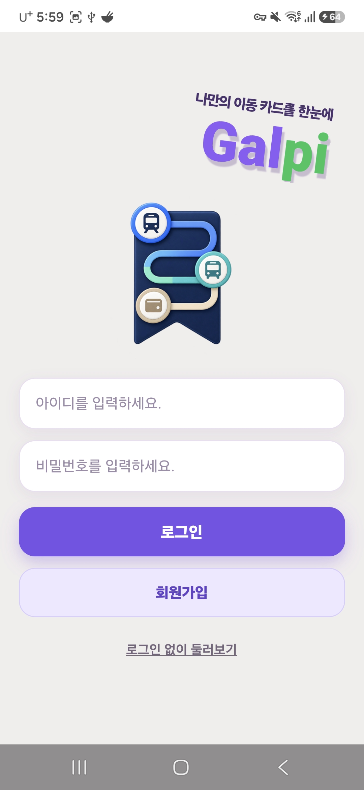 | 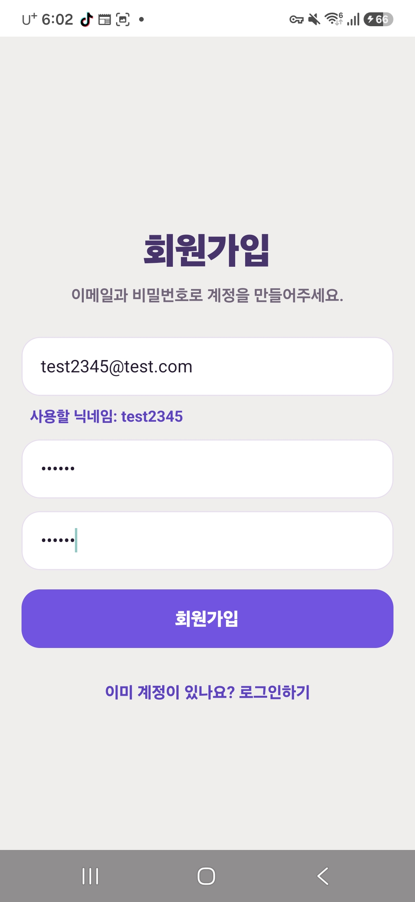 | 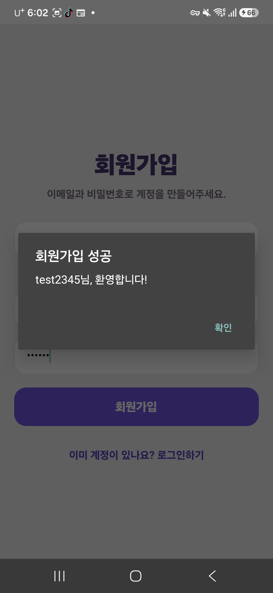 |

### 2. 카드 생성

| 빈 홈 화면 | 카드 색상 설정 |
| --- | --- |
| 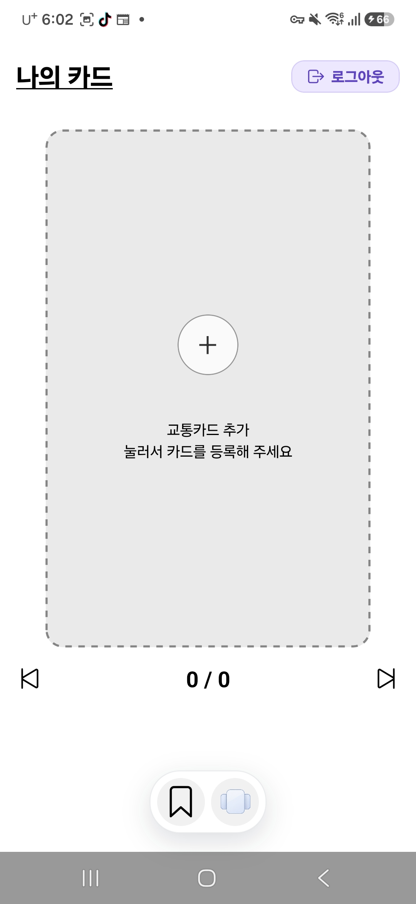 | 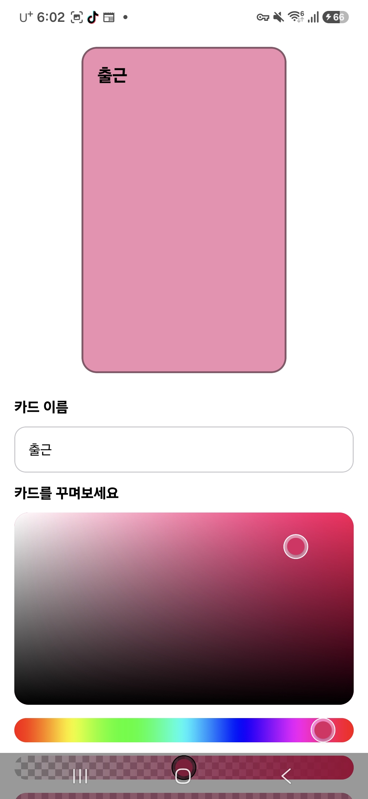 |

### 3. 경로 추가

| 지하철 경로 추가 | 버스 노선 검색 | 버스 정류장 선택 |
| --- | --- | --- |
| 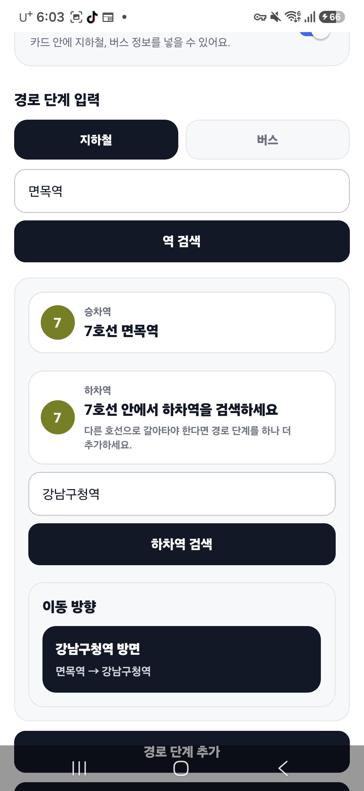 | 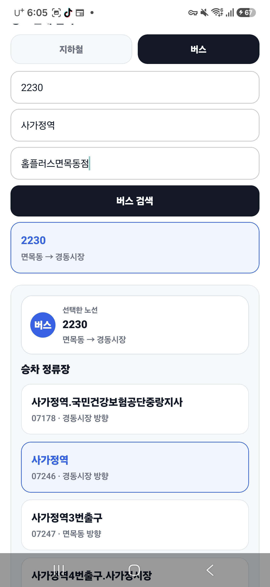 | 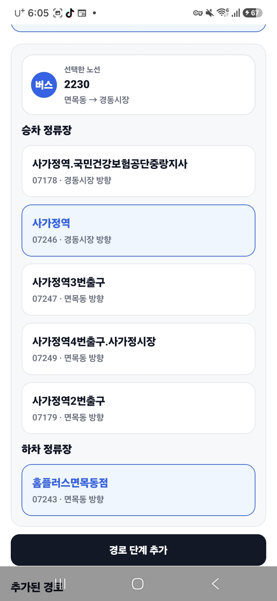 |

| 경로 추가 완료 |
| --- |
| 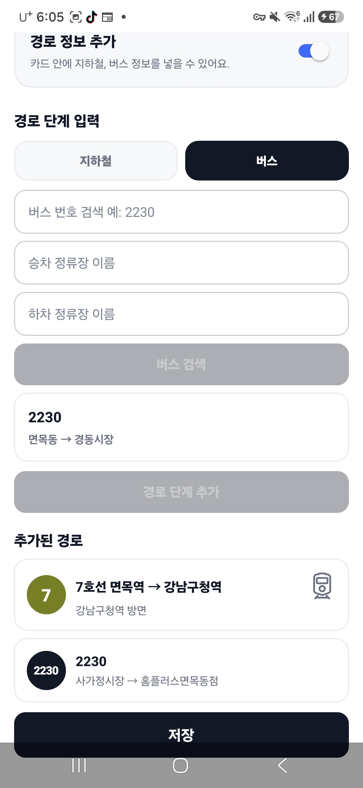 |

### 4. 카드 저장 및 상세 화면

| 카드 저장 후 홈 화면 | 카드 상세 실시간 도착정보 |
| --- | --- |
| 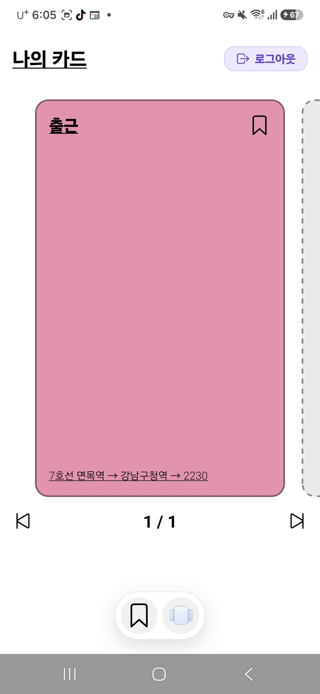 | 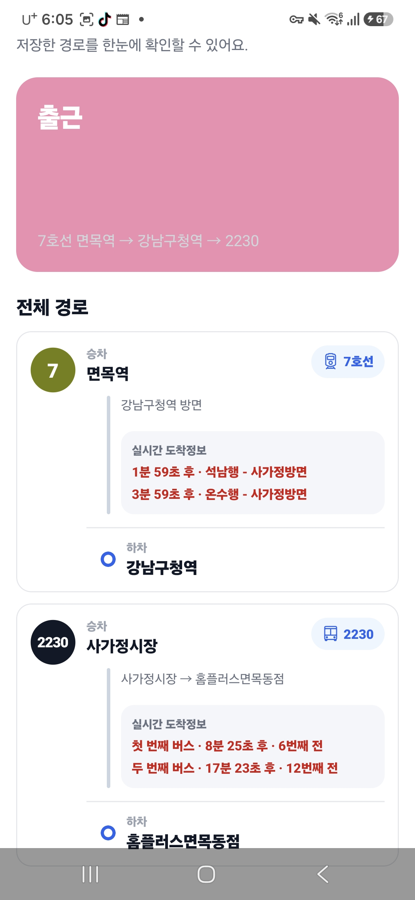 |

### 5. 홈 화면 기능

| 즐겨찾기 설정 | 즐겨찾기 카드 보기 | 보기 모드 전환 |
| --- | --- | --- |
| 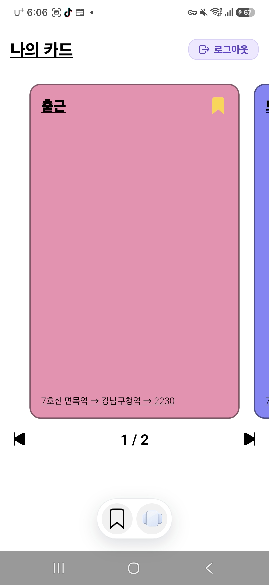 | 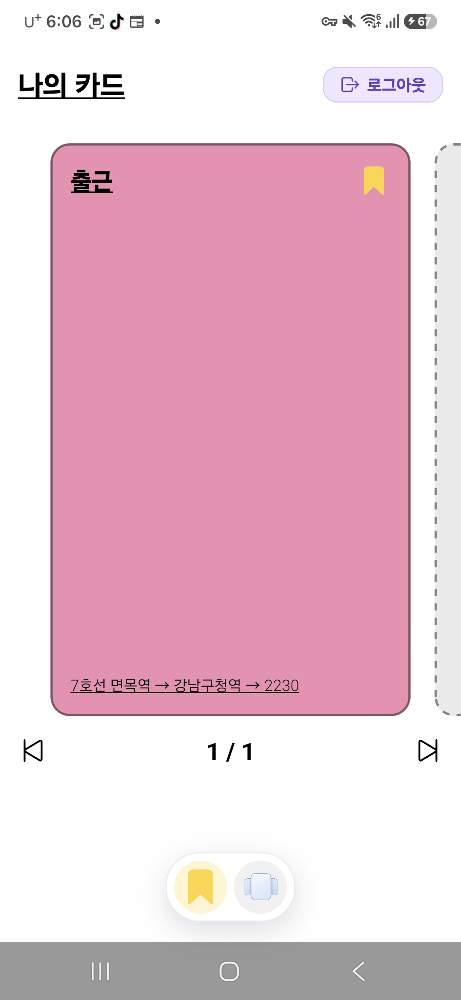 | 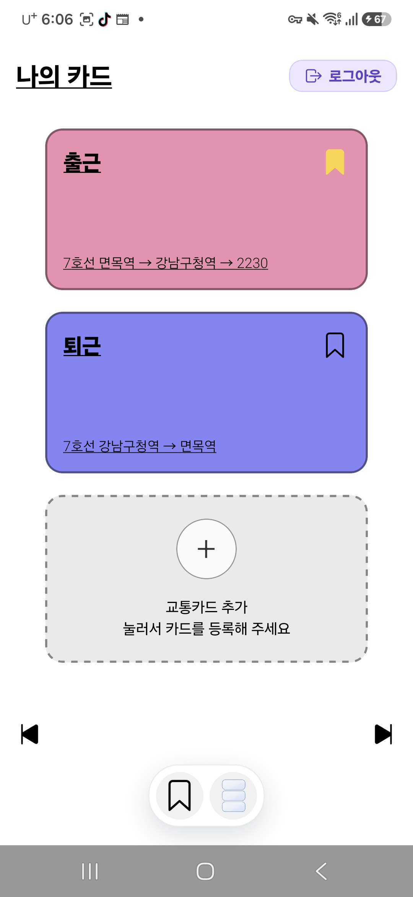 |
  
